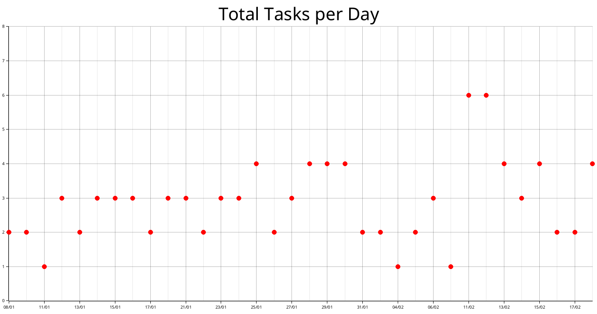

# HABITSCORE-MD

## What is HabitScore-MD

HabitScore-MD is a simple Rust program that reads a Markdown file where I log my daily tasks along with their importance. The program counts how many tasks have been completed and how many have not, then calculates a score and level based on task importance.

## Features

This program is quite basic, but it includes one feature: it generates a chart showing the number of tasks for each day. The chart is still in early stage and will be improved in future updates.



## Usage

``` bash
git clone https://github.com/mlahlal/habitscore-md
cd habitscore-md
cargo build --release
./target/release/habitscore-md -p /path/to/md/file
```

There are also some flags you can use :
- -d : Debug mode
- -s : Generates the chart and prints frequently incomplete tasks
